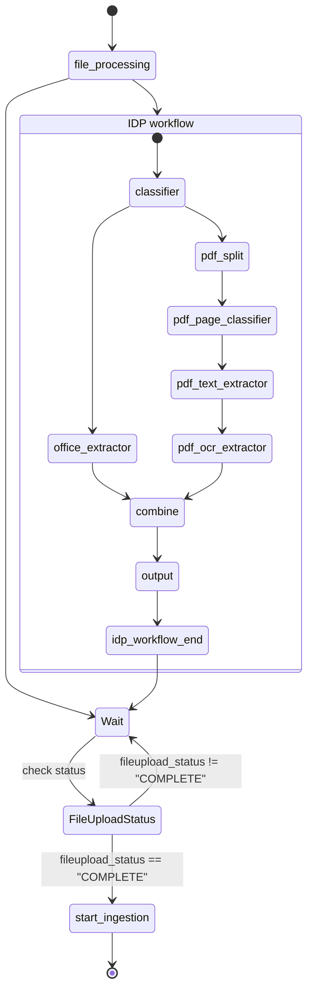

# File Ingestion Step Function Workflow

This document describes the `FileIngestionStateMachine` defined in
`services/file-ingestion/template.yaml`. The state machine copies an uploaded
file to the IDP bucket, polls until text extraction finishes, and finally
launches the ingestion pipeline.

## States

**file_processing**
: Task state that invokes `file-processing-lambda` using
  `arn:aws:states:::lambda:invoke`. The entire event is forwarded as the payload
  so the lambda can copy the uploaded file from the staging bucket into
  `IDP_BUCKET/RAW_PREFIX`. A retry policy handles transient Lambda errors.
  The handler assigns a new random `document_id` using `uuid.uuid4().hex` and
  includes it in the response for downstream services.

**Wait**
: Waits `StatusPollSeconds` seconds before checking the file's status again.

**FileUploadStatus**
: Invokes `file-processing-status-lambda` to determine if text extraction has
  completed. The lambda populates `fileupload_status` in the state input
  (for example `"PENDING"` or `"COMPLETE"`). The same retry policy is applied
  here as in **file_processing**.

**Choice**
: Evaluates `fileupload_status` using the JSONata expression
  `not(($states.input.body.fileupload_status) = ("COMPLETE"))`. If true, the
  workflow loops back to **Wait**; otherwise it transitions to
  **start_ingestion**.

**start_ingestion**
: Triggers the RAG ingestion Step Function referenced by `IngestionStateMachineArn`
  using `states:startExecution.sync`. JSONata expressions pull `documentId`,
  `ingest_params`, `collection_name`, `file_guid` and `file_name` from the input
  and build the nested JSON payload for the downstream state machine.

The `Definition` block declares `QueryLanguage: JSONata` so that these
expressions can be used for input and output processing.

## IDP Workflow

When the file is copied to the IDP bucket the following Lambdas run in
sequence via S3 triggers:

1. **classifier** – routes PDFs with text directly to `OFFICE_PREFIX` and other
   files to be split into pages.
2. **office_extractor** – converts Office documents into Markdown pages under
   `TEXT_DOC_PREFIX`.
3. **pdf_split** – splits PDFs into per-page files stored under `PAGE_PREFIX`.
4. **pdf_page_classifier** – determines whether a page requires OCR or has
   embedded text.
5. **pdf_text_extractor** – extracts text from pages with embedded text.
6. **pdf_ocr_extractor** – runs OCR on scanned pages, using the configured
   engine.
7. **combine** – waits until all page outputs exist and merges them into a
   single JSON document.
8. **output** – posts the combined result to an external API and writes any
   response to `OUTPUT_PREFIX`.
