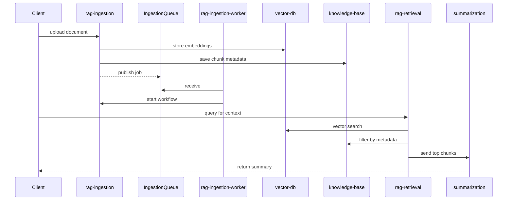

# RAG Architecture Overview

This guide illustrates how the retrieval augmented generation components connect across services. It covers document ingestion, embedding creation, vector search and summarization.

## Components

- **rag-ingestion** – chunks documents and generates embeddings.
- **rag-ingestion-worker** – polls `IngestionQueue` and starts the ingestion workflow, moving failed messages to a DLQ.
- **vector-db** – maintains Milvus collections used for semantic search.
- **knowledge-base** – stores metadata for ingested chunks and exposes `/kb/*` endpoints.
- **rag-retrieval** – performs vector search and orchestrates summarization with context.
- **summarization** – Step Function workflow that can call retrieval functions when creating summaries.

## End-to-End Flow

The ingestion services generate embeddings and store metadata. Retrieval functions later query the vector database and pass the results to the summarization stack.

The summarization Step Function may invoke retrieval during its workflow to supply relevant context before generating the final response. Both ingestion and retrieval rely on the `vector-db` service to manage Milvus collections.

Ingestion requests can also be published to an SQS queue. The `rag-ingestion-worker`
Lambda polls this queue and triggers the `IngestionStateMachine` for each message.
Failed jobs are moved to a dead letter queue and retried automatically using the
`batchItemFailures` response format.
