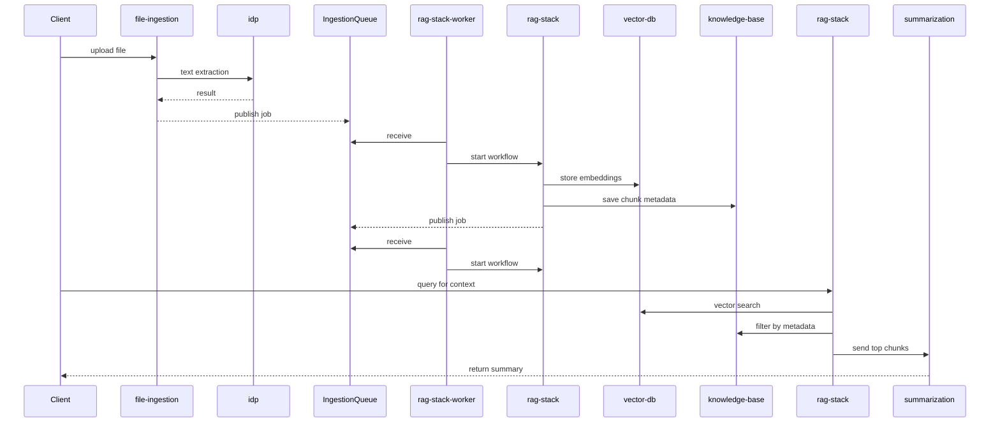

# RAG Architecture Overview

This guide illustrates how the retrieval augmented generation components connect across services. It covers document ingestion, embedding creation, vector search and summarization.

## Components

- **file-ingestion** – orchestrates text extraction and enqueues ingestion jobs.
- **idp** – Intelligent Document Processing pipeline used by file-ingestion for OCR and classification.
- **rag-stack** – chunks documents, generates embeddings and performs retrieval.
- **rag-stack-worker** – polls `IngestionQueue` and starts the ingestion workflow, moving failed messages to a DLQ. The queue URL is exported as `IngestionQueueUrl` for other stacks.
- **vector-db** – manages Milvus or Elasticsearch backends used for semantic search.
- **knowledge-base** – stores metadata for ingested chunks and exposes `/kb/*` endpoints.
- **summarization** – Step Function workflow that can call retrieval functions when creating summaries.

## End-to-End Flow

The ingestion services generate embeddings and store metadata. Retrieval functions later query the vector database and pass the results to the summarization stack.

The summarization Step Function may invoke retrieval during its workflow to supply
relevant context before generating the final response. Both ingestion and
retrieval rely on the `vector-db` service to manage vector database backends.

In a typical flow the `file-ingestion` Step Function copies the file to the IDP
bucket and waits until text extraction completes. After the IDP pipeline
produces the parsed document, `file-ingestion` publishes the ingestion
parameters to `IngestionQueue`. The `rag-stack-worker` Lambda dequeues these
messages and starts the `IngestionStateMachine`. Failed jobs are moved to a dead
letter queue and retried automatically using the `batchItemFailures` response
format.
