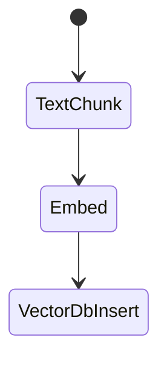
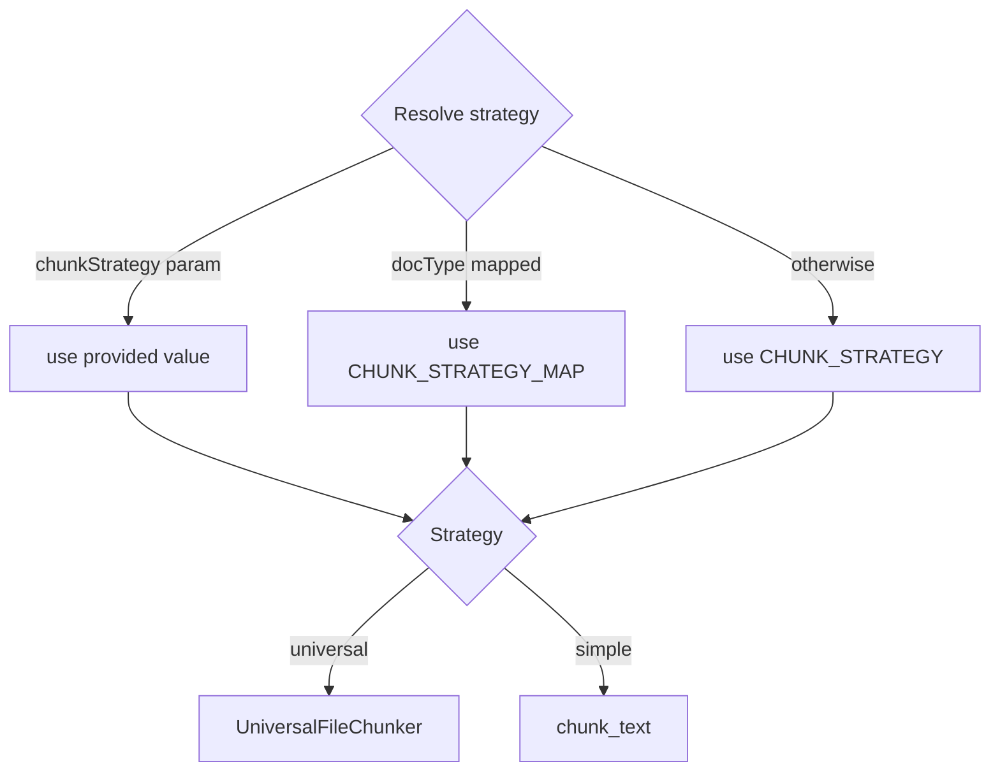
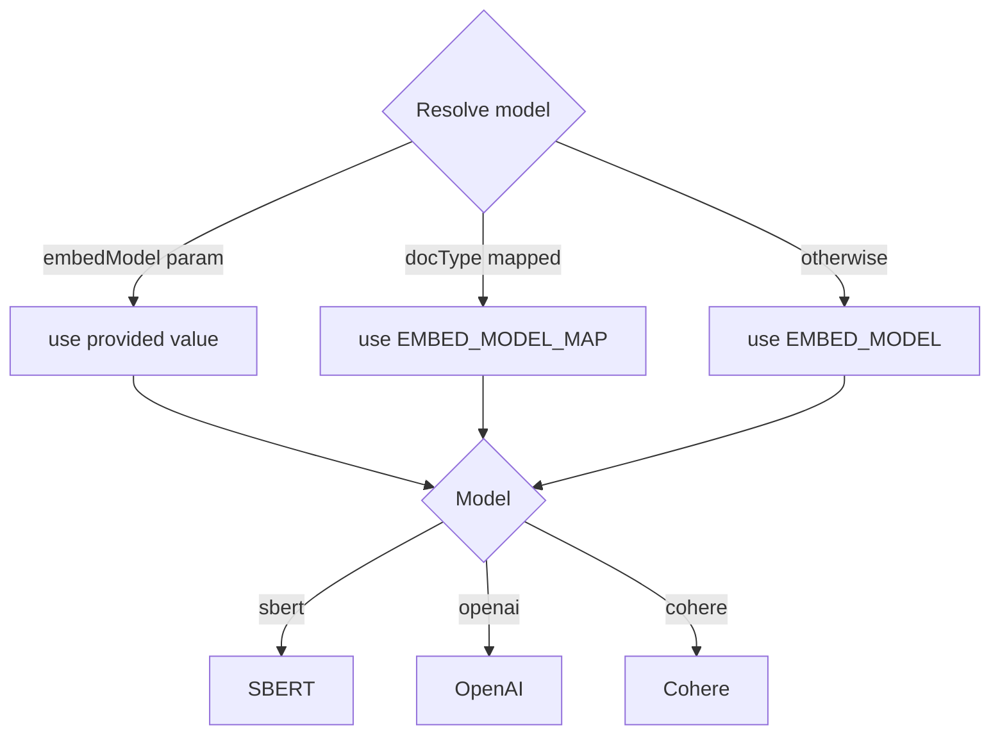

# RAG Ingestion Step Function Workflow

This document describes the `IngestionStateMachine` defined in
`services/rag-stack/template.yaml`. The workflow is typically started by the
`rag-stack-worker` after the `file-ingestion` Step Function runs the IDP
pipeline to extract text from an uploaded file and enqueues a message. New
objects placed under `TextDocPrefix` in the configured S3 bucket can also
trigger the workflow directly. The state machine splits the text into chunks,
generates embeddings and stores them in a vector database.

## States

**TextChunk**
: Invokes `text-chunk-lambda` to split the input text into overlapping chunks.
  The resulting list is forwarded to the next state.

**Embed**
: Calls `embed-lambda` for each chunk to compute vector embeddings.

**VectorDbInsert**
: Sends the embeddings to the vector database insert Lambda which stores them along with
  any metadata, ending the workflow.

## Chunk Strategy

`text-chunk-lambda` supports two approaches for breaking documents into
manageable pieces. By default it uses a simple paragraph and sentence based
algorithm implemented by `chunk_text`. When the `universal` strategy is
selected the `UniversalFileChunker` from `common/chunking` is used. This
specialised chunker can detect Jupyter notebooks and common code formats.

The strategy is resolved using the following inputs:

- `chunkStrategy` field in the event payload
- `CHUNK_STRATEGY_MAP` mapping `docType` to a strategy
- fallback `CHUNK_STRATEGY` environment variable

The chunk size and overlap come from `CHUNK_SIZE` and `CHUNK_OVERLAP` (defaults
`1000` and `100`). When `EXTRACT_ENTITIES` is true, named entities are added to
each chunk's metadata. Every chunk also stores the originating `file_guid`, a
`hash_key` of the text, the `file_name` and any detected `entities` so that
queries can filter or trace results back to the source document.

## Embedding Strategy

`embed-lambda` selects the embedding model in a similar manner. The default is
`sbert` but a per-document override can be supplied. Supported models include
SBERT, OpenAI and Cohere.

Environment variables used:

- `EMBED_MODEL` and optional `EMBED_MODEL_MAP`
- `SBERT_MODEL`, `OPENAI_EMBED_MODEL`, `COHERE_SECRET_NAME`

The lambda embeds each chunk with the resolved provider and forwards the
embeddings and metadata to the vector DB insert step.

## Queue-based Invocation

Large ingestion jobs may be placed on an SQS queue instead of calling the state
machine directly. This is normally done by the `file-ingestion` service after
the IDP pipeline finishes extracting text from a document. The
`rag-stack-worker` Lambda monitors the queue and starts
`IngestionStateMachine` for each message. Any failed messages are moved to
`IngestionDLQ` and retried automatically. The queue URL is exported from the
stack as `IngestionQueueUrl`.
