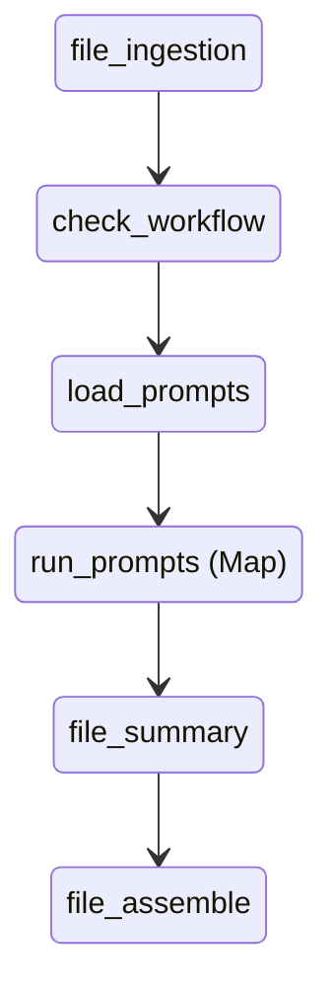

# Summarization Step Function Workflow

This document describes the multi-step AWS Step Functions state machine that orchestrates the summarization pipeline. The workflow ingests a document, runs a series of prompts in parallel, and generates a summary file that can be PDF, DOCX, JSON or XML, optionally merging PDF or DOCX output with the original document.  Prompt execution is handled by the **llm-gateway** service which renders templates and forwards the requests to the chosen backend.



## Map State

The `run_prompts` state uses the [Map](https://docs.aws.amazon.com/step-functions/latest/dg/amazon-states-language-map-state.html) state type to send each prompt to an SQS queue. Worker Lambdas consume these messages, invoke the summarization logic and return the results using task tokens. The summaries are collected in `$.run_prompts`.

Concurrency is controlled via the `MaxConcurrency` field in `template.yaml`:

```yaml
run_prompts:
  Type: Map
  ItemsPath: $.body.prompts
  ResultPath: $.run_prompts
  MaxConcurrency: 10
  Iterator:
    StartAt: summarize
    States:
      summarize:
        Type: Task
        Resource: arn:aws:states:::sqs:sendMessage.waitForTaskToken
        Parameters:
          QueueUrl: <queue-url>
          MessageBody:
            token.$: $$.Task.Token
            query.$: $$Map.Item.Value.query
            Title.$: $$Map.Item.Value.Title
        Next: add_title
      add_title:
        Type: Pass
        Parameters:
          Title.$: $.Title
          content.$: $.summary
        End: true
```

Change the value of `MaxConcurrency` to adjust how many prompts are processed in parallel.

## Providing the Prompts List

The Step Function expects a list of prompt objects under `body.prompts` when the execution starts. Each object should contain at least a `query` string and optional `Title` used by later steps. The list can be supplied in three ways:

1. **Execution input** – Pass the `prompts` array directly in the `StartExecution` payload.
2. **S3 object** – Store the prompts JSON in S3 and include the bucket/key in the input. A Lambda (not shown here) can load the file and inject the array into `body.prompts` before the `Map` state runs.
3. **Workflow ID** – Provide a `workflow_id` value. The `load_prompts` state retrieves all prompts tagged with this ID from the LLM Gateway and populates `body.prompts` automatically. It also loads the workflow's system prompt and sets `body.llm_params.system_prompt`.

## Role of `file-summary-lambda`

Previously this Lambda generated the summaries itself. The revised workflow delegates summarization to the `run_prompts` `Map` state. `file-summary-lambda` now receives the pre-generated summaries, formats them according to an optional `output_format` field (PDF, DOCX, JSON or XML), and uploads the resulting file back to S3.

## LLM Gateway Integration

Each object in `body.prompts` may optionally include a `prompt_id` value. When present, the `summarize-worker-lambda` sends this identifier to the LLM Gateway before invoking the summarization logic. The gateway loads the matching template from its DynamoDB table, substitutes any variables and forwards the rendered prompt to the selected backend. Only the side effect of calling the gateway is required&mdash;the worker still passes the original `query` to the summarization Lambda.

Example entry in `body.prompts`:

```json
{
  "prompt_id": "Medical_Summary",
  "Title": "Summary",
  "variables": {"text": "<document text>"}
}
```

Sample templates such as `use-cases/aps-summarization/config/aps_prompts.json` can be loaded into the gateway's DynamoDB table. Listing the corresponding `prompt_id`s in the execution input ensures the Step Function pushes each prompt to the queue where the worker contacts the service.

## Supplying a System Prompt

Model parameters are provided under `body.llm_params`. To control the LLM's behaviour you can add a `system_prompt` entry. The queue worker forwards `llm_params` to the `llm-gateway` Lambda which applies the system prompt when calling the model. An example prompt is located in `file-summary-lambda/system_prompt.json`.

```json
{
  "body": {
    "prompts": [{"query": "Summary query"}],
    "llm_params": {
      "system_prompt": "<prompt text>"
    }
  }
}
```

### Using `workflow_id`

Instead of a `prompts` array you can provide a `workflow_id` referencing a saved
collection of prompts. The state machine will fetch the list from the LLM Gateway's prompt engine automatically and include the workflow's system prompt:

```json
{
  "body": {
    "workflow_id": "aps",
    "collection_name": "my-collection"
  }
}
```
