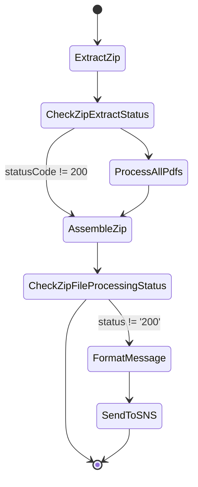
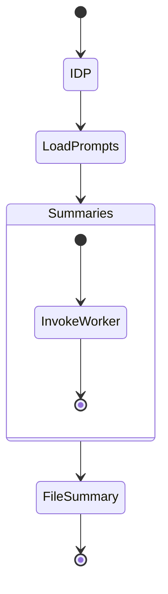

# APS Summarization Workflow

This guide explains how a ZIP uploaded by an underwriter is processed end‑to‑end to produce a final archive containing summary documents.  The workflow combines the **zip-processing** and **summarization** Step Functions along with the IDP and retrieval services.

## High level flow



1. **ExtractZip** reads the uploaded archive from S3 and returns the S3 keys of the contained PDFs.
2. **ProcessAllPdfs** maps each extracted file through the per‑file `FileProcessingStepFunction` from the **summarization** service.
3. **AssembleZip** collects each generated summary PDF and writes the final ZIP to S3.
4. **SendToSNS** notifies stakeholders when any file fails.

## Per‑file Step Function

`FileProcessingStepFunction` orchestrates IDP extraction, prompt loading and summarization for a single PDF.



1. **IDP** invokes the `FileIngestionStateMachine` from **file-ingestion** which runs the IDP OCR pipeline.
2. **LoadPrompts** calls `load-prompts-lambda` to fetch templates from the prompt engine. The Lambda posts the `workflow_id` received in the input to the gateway endpoint and returns the prompts along with a system prompt.
3. **Summaries** iterates over the prompts and sends each one to `summarize-worker-lambda`.
4. The worker Lambda invokes the retrieval Lambda from **rag-stack**. This queries the Milvus vector database via **vector-db** and forwards the assembled context to the LLM gateway for summarization.
5. **FileSummary** assembles the results (typically PDF or DOCX) using `file-summary-lambda`. The summary document is uploaded to S3 and the Step Function output conforms to the schema in [event_schemas.md](event_schemas.md#summarization-event).

The initial input for the state machine must match the [Summarization Workflow Input](event_schemas.md#summarization-workflow-input). The output from each worker conforms to [RAG Summarization Payload](event_schemas.md#rag-summarization-payload).

## Loading APS prompts

Sample prompts for this workflow reside in `use-cases/aps-summarization/config`. The JSON files can be loaded into the prompt engine's DynamoDB table using the AWS CLI:

```bash
aws dynamodb put-item \
  --table-name <PromptLibraryTable> \
  --item file://use-cases/aps-summarization/config/aps_prompts.json
```

`system_prompt.json` contains the default system prompt referenced by `SYSTEM_WORKFLOW_ID` in `load-prompts-lambda`. Additional labels such as section headings are provided in `summary_labels.json` for use when generating the final document.

`file-summary-lambda` automatically looks for `summary_labels.json` inside the
directory defined by the `FONT_DIR` environment variable.  A different location
or an SSM parameter name can be supplied via the `labels_path` property in the
workflow input.  The APS wrapper forwards both `font_dir` and `labels_path`
properties to the summarization state machine so custom fonts and labels can be
used without modifying the underlying service.

Together these components transform uploaded APS archives into searchable summaries packaged as a new ZIP.
