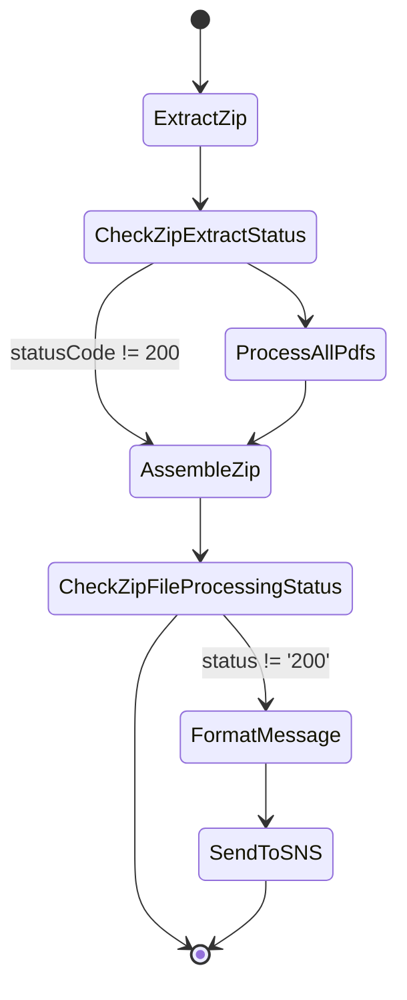
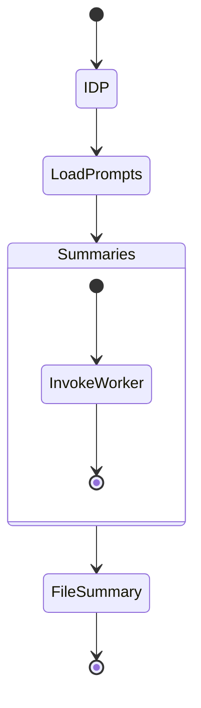

# APS Summarization Workflow

This guide explains how a ZIP uploaded from Globalscape to S3 bucket is processed end‑to‑end to produce a final archive containing summary documents.  The workflow combines the **zip-processing** and **summarization** Step Functions along with the IDP and retrieval services.

## High level flow



1. **ExtractZip** reads the uploaded archive from S3 and returns the S3 keys of the contained PDFs.
2. **ProcessAllPdfs** maps each extracted file through a per‑file workflow that
   invokes the file-ingestion service and then posts a message to the
   **summarization** service via SQS.
3. **AssembleZip** collects each generated summary PDF and writes the final ZIP to S3.
4. **SendToSNS** notifies stakeholders when any file fails.

## Per‑file Step Function

This per‑file workflow orchestrates IDP extraction and then enqueues a request
for `SummarizationWorkflow` to generate the final summary.



1. **IDP** invokes the `FileIngestionStateMachine` from **file-ingestion** which runs the IDP OCR pipeline.
2. **LoadPrompts** calls `load-prompts-lambda` to fetch templates from the prompt engine. The Lambda posts the `workflow_id` received in the input to the gateway endpoint and returns the prompts along with a system prompt.
3. **Summaries** iterates over the prompts and sends each one to `summarize-worker-lambda`.
4. The worker Lambda invokes the retrieval Lambda from **rag-stack**. This queries the Milvus vector database via **vector-db** and forwards the assembled context to the LLM gateway for summarization.
5. **FileSummary** assembles the results (typically PDF or DOCX) using `file-summary-lambda`. The summary document is uploaded to S3 and the Step Function output conforms to the schema in [event_schemas.md](../../docs/event_schemas.md#summarization-event).

The initial input for the state machine must match the [Summarization Workflow Input](../../docs/event_schemas.md#summarization-workflow-input). The output from each worker conforms to [RAG Summarization Payload](../../docs/event_schemas.md#rag-summarization-payload).

## Loading APS prompts

Sample prompts for this workflow reside in `use-cases/aps-summarization/config`. The JSON files can be loaded into the prompt engine's DynamoDB table using the AWS CLI:

```bash
aws dynamodb put-item \
  --table-name <PromptLibraryTable> \
  --item file://use-cases/aps-summarization/config/aps_prompts.json
```

`system_prompt.json` contains the default system prompt referenced by `SYSTEM_WORKFLOW_ID` in `load-prompts-lambda`. Additional labels such as section headings are provided in `summary_labels.json` for use when generating the final document.

`file-summary-lambda` automatically looks for `summary_labels.json` inside the
directory defined by the `FONT_DIR` environment variable.  A different location
or an SSM parameter name can be supplied via the `labels_path` property in the
workflow input.  The APS wrapper forwards both `font_dir` and `labels_path`
properties to the summarization state machine so custom fonts and labels can be
used without modifying the underlying service.

Together these components transform uploaded APS archives into searchable summaries packaged as a new ZIP.

This directory contains a wrapper around the generic summarization
service for processing Attending Physician Statements (APS).  The
`template.yaml` deploys a Step Function that now launches the ZIP
processing workflow which in turn extracts the archive, runs the
summarization state machine for each PDF and finally assembles a new
ZIP file.  After the archive is created the APS workflow invokes an
optional post processing Lambda.

## Environment variables

`aps_workflow_lambda.py` and the underlying `file_summary_lambda`
expect `FONT_DIR` to point to a folder containing TrueType fonts.
The provided template passes the `FontDir` parameter value to both
functions so PDFs can be generated using `DejaVuSans.ttf` and
`DejaVuSans-Bold.ttf` shipped in `src/`.
The `file_summary_lambda` also searches this directory for a
`summary_labels.json` file.  You can override the location or supply an
SSM parameter name via the `labels_path` property on the workflow input.

## Parameters

- `AWSAccountName` – prefix for stack resources.
- `FileAssembleFunctionArn` – ARN of the file assembly Lambda.
- `FileIngestionStateMachineArn` – ARN of the file ingestion workflow.
- `PromptEngineEndpoint` – URL of the prompt engine service.
- `RAGSummaryFunctionArn` – ARN of the retrieval summarization Lambda.
- `FileProcessingEmailId` – email address for ZIP processing failure reports.
- `LambdaIAMRoleARN` – IAM role used by the Lambda function and state machine.
- `LambdaSubnet1ID` / `LambdaSubnet2ID` – subnets for the Lambda function.
- `LambdaSecurityGroupID1` / `LambdaSecurityGroupID2` – security groups for network access.
- `FontDir` – directory with font files (default `./src`).
- `LabelsPath` – path or SSM name for `summary_labels.json` (default `./config/summary_labels.json`).

The APS state machine forwards the `FontDir` and `LabelsPath` values as
`font_dir` and `labels_path` properties when it starts the summarization
workflow.  These settings allow `file_summary_lambda` to load custom fonts
and labels without modifying the core service.

## Deployment

Deploy the use case with SAM:

```bash
sam deploy \
  --template-file use-cases/aps-summarization/template.yaml \
  --stack-name aps-summarization \
  --parameter-overrides \
    AWSAccountName=<name> \
    LambdaIAMRoleARN=<role-arn> \
    LambdaSubnet1ID=<subnet1> \
    LambdaSubnet2ID=<subnet2> \
    LambdaSecurityGroupID1=<sg1> \
    LambdaSecurityGroupID2=<sg2> \
    FileAssembleFunctionArn=<arn> \
    FileIngestionStateMachineArn=<arn> \
    PromptEngineEndpoint=<endpoint> \
    RAGSummaryFunctionArn=<arn> \
    FileProcessingEmailId=<email> \
    FontDir=<font_dir> \
    LabelsPath=<labels_path>
```
