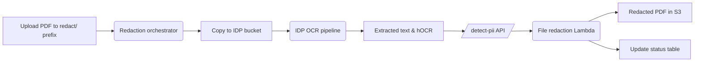

# Mail Room Redaction Workflow

This example deploys the IDP, anonymization and redaction services to sanitize
letters uploaded to the Ameritas mail room. Incoming PDFs are processed through
OCR, PII/PHI is detected using configurable regex patterns and the final
redacted file is written back to S3.

## Workflow



## Configuration

The anonymization service reads configuration from Parameter Store or the Lambda
environment. Populate these variables before deployment:

- `NER_LIBRARY` and related model variables (`SPACY_MODEL` or `HF_MODEL`)
- `REGEX_PATTERNS` – JSON map of custom detectors
- `ANON_MODE` – `mask`, `pseudo` or `token`
- Deterministic pseudonymization may require modifying
  `mask_text_lambda.py` to reuse replacements for repeated entities
  within the same document.

Create parameters named as above under `/parameters/aio/ameritasAI/<ENV>/` or
export them as environment variables. See
[services/anonymization/README.md](../../services/anonymization/README.md) and
[docs/environment_variables.md](../../docs/environment_variables.md#sensitive-info-detection)
for details.

## Deployment

Deploy all required services with SAM. The stack parameters provide network and
IAM settings shared by each nested application. `RegexPatterns` should contain a
JSON map of custom detectors for the anonymization service. A sample file is
included under `config/mailroom_regex_patterns.json`.

```bash
sam deploy \
  --template-file use-cases/mail-room-redaction/template.yaml \
  --stack-name mail-room-redaction \
  --parameter-overrides \
    AWSAccountName=<name> \
    LambdaIAMRoleARN=<role-arn> \
    LambdaSubnet1ID=<subnet1> \
    LambdaSubnet2ID=<subnet2> \
    LambdaSecurityGroupID1=<sg1> \
    LambdaSecurityGroupID2=<sg2> \
    RegexPatterns="$(cat use-cases/mail-room-redaction/config/mailroom_regex_patterns.json)"
```

## Uploading mail room letters

Letters can be submitted either via the ingestion API or by uploading
directly to the IDP bucket. The SAM template connects the Redaction Service to
`s3:ObjectCreated:*` events so any file placed under the configured
`SourcePrefix` (default `redact/`) triggers the orchestrator:

```yaml
SourceBucket: !Ref IdpBucketName
SourcePrefix: redact/
Events:
  Upload:
    Type: S3
    Properties:
      Bucket: !Ref SourceBucket
      Events: s3:ObjectCreated:*
      Filter:
        S3Key:
          Rules:
            - Name: prefix
              Value: !Ref SourcePrefix
```

When the event fires, the workflow copies the uploaded PDF to the IDP bucket so
OCR can run before redaction begins.

## Retrieving redacted PDFs

Documents uploaded via either method are copied to the IDP bucket for OCR
extraction. Once processing is complete the `redact_file_lambda` from
**file-assembly** writes the PDF back to the same bucket using the prefix from
the `REDACTED_PREFIX` environment variable (see
[services/file-assembly/README.md](../../services/file-assembly/README.md#environment-variable)).
Locate the final PDF at:

```
s3://<IDP bucket>/<RedactedPrefix><original filename>
```

The associated DynamoDB table exported as `RedactionStatusTableName` records the
processing status for each document.
